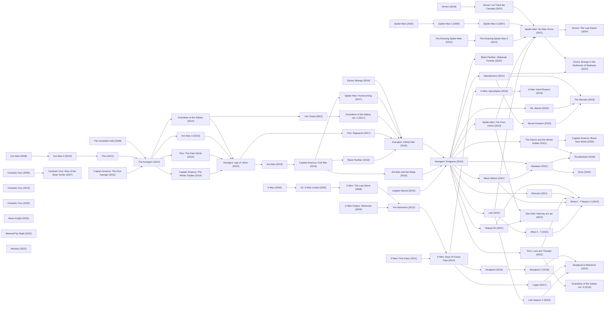

```mermaid
graph LR
  %% MCU Phase 1
  Iron_Man_2008["Iron Man (2008)"]
  Incredible_Hulk_2008["The Incredible Hulk (2008)"]
  Iron_Man_2_2010["Iron Man 2 (2010)"]
  Thor_2011["Thor (2011)"]
  Captain_America_The_First_Avenger_2011["Captain America: The First Avenger (2011)"]
  Avengers_2012["The Avengers (2012)"]

  %% MCU Phase 2
  Iron_Man_3_2013["Iron Man 3 (2013)"]
  Thor_The_Dark_World_2013["Thor: The Dark World (2013)"]
  Captain_America_The_Winter_Soldier_2014["Captain America: The Winter Soldier (2014)"]
  Guardians_of_the_Galaxy_2014["Guardians of the Galaxy (2014)"]
  Avengers_Age_of_Ultron_2015["Avengers: Age of Ultron (2015)"]
  Ant_Man_2015["Ant-Man (2015)"]

  %% MCU Phase 3
  Captain_America_Civil_War_2016["Captain America: Civil War (2016)"]
  Doctor_Strange_2016["Doctor Strange (2016)"]
  Guardians_of_the_Galaxy_Vol2_2017["Guardians of the Galaxy Vol. 2 (2017)"]
  Spider_Man_Homecoming_2017["Spider-Man: Homecoming (2017)"]
  Thor_Ragnarok_2017["Thor: Ragnarok (2017)"]
  Black_Panther_2018["Black Panther (2018)"]
  Avengers_Infinity_War_2018["Avengers: Infinity War (2018)"]
  Ant_Man_and_the_Wasp_2018["Ant-Man and the Wasp (2018)"]
  Captain_Marvel_2019["Captain Marvel (2019)"]
  Avengers_Endgame_2019["Avengers: Endgame (2019)"]
  Spider_Man_Far_From_Home_2019["Spider-Man: Far From Home (2019)"]

  %% MCU Phase 4
  Black_Widow_2021["Black Widow (2021)"]
  Shang_Chi_2021["Shang-Chi (2021)"]
  Eternals_2021["Eternals (2021)"]
  Spider_Man_No_Way_Home_2021["Spider-Man: No Way Home (2021)"]
  Doctor_Strange_Multiverse_of_Madness_2022["Doctor Strange in the Multiverse of Madness (2022)"]
  Thor_Love_and_Thunder_2022["Thor: Love and Thunder (2022)"]
  Black_Panther_Wakanda_Forever_2022["Black Panther: Wakanda Forever (2022)"]
  The_Marvels_2023["The Marvels (2023)"]
  Captain_America_Brave_New_World_2025["Captain America: Brave New World (2025)"]
  Thunderbolts_2025["Thunderbolts (2025)"]

  %% X-Men Universe (Fox)
  XMen_Origins_Wolverine_2009["X-Men Origins: Wolverine (2009)"]
  XMen_2000["X-Men (2000)"]
  X2_2003["X2: X-Men United (2003)"]
  XMen_The_Last_Stand_2006["X-Men: The Last Stand (2006)"]
  XMen_First_Class_2011["X-Men: First Class (2011)"]
  XMen_Days_of_Future_Past_2014["X-Men: Days of Future Past (2014)"]
  The_Wolverine_2013["The Wolverine (2013)"]
  XMen_Apocalypse_2016["X-Men: Apocalypse (2016)"]
  XMen_Dark_Phoenix_2019["X-Men: Dark Phoenix (2019)"]
  Logan_2017["Logan (2017)"]

  %% Deadpool Universe (Fox/X-Men)
  Deadpool_2016["Deadpool (2016)"]
  Deadpool_2_2018["Deadpool 2 (2018)"]
  Deadpool_3_2024["Deadpool & Wolverine (2024)"]

  %% Fantastic Four (Fox & MCU)
  Fantastic_Four_2005["Fantastic Four (2005)"]
  Fantastic_Four_Rise_2007["Fantastic Four: Rise of the Silver Surfer (2007)"]
  Fantastic_Four_2015["Fantastic Four (2015)"]
  Fantastic_Four_MCU_2025["Fantastic Four (2025)"]
  %% MCU Web Series
  WandaVision_2021["WandaVision (2021)"]
  Falcon_and_Winter_Soldier_2021["The Falcon and the Winter Soldier (2021)"]
  Loki_2021["Loki (2021)"]
  Loki_Season_2_2023["Loki Season 2 (2023)"]
  What_If_2021["What If...? (2021)"]
  What_If_Season_2_2023["What If...? Season 2 (2023)"]
  Hawkeye_2021["Hawkeye (2021)"]
  Moon_Knight_2022["Moon Knight (2022)"]
  Ms_Marvel_2022["Ms. Marvel (2022)"]
  She_Hulk_2022["She-Hulk: Attorney at Law (2022)"]
  Werewolf_by_Night_2022["Werewolf by Night (2022)"]
  Secret_Invasion_2023["Secret Invasion (2023)"]
  I_Am_Groot_2022["I Am Groot (2022)"]
  Echo_2024["Echo (2024)"]
  The_Marvels_2023["The Marvels (2023)"]

  %% Guardians of the Galaxy Universe
  Guardians_of_the_Galaxy_2014["Guardians of the Galaxy (2014)"]
  Guardians_of_the_Galaxy_Vol2_2017["Guardians of the Galaxy Vol. 2 (2017)"]
  Guardians_of_the_Galaxy_Vol3_2023["Guardians of the Galaxy Vol. 3 (2023)"]

  %% Tom Hardy's Venom Universe (Sony's Spider-Man Universe)
  Venom_2018["Venom (2018)"]
  Venom_Let_There_Be_Carnage_2021["Venom: Let There Be Carnage (2021)"]
  Venom_The_Last_Dance_2024["Venom: The Last Dance (2024)"]

  %% Morbius Universe
  Morbius_2022["Morbius (2022)"]

  %% Tobey Maguire Spider-Man Universe
  Spider_Man_2002["Spider-Man (2002)"]
  Spider_Man_2_2004["Spider-Man 2 (2004)"]
  Spider_Man_3_2007["Spider-Man 3 (2007)"]

  %% Andrew Garfield Spider-Man Universe
  Amazing_Spider_Man_2012["The Amazing Spider-Man (2012)"]
  Amazing_Spider_Man_2_2014["The Amazing Spider-Man 2 (2014)"]

  %% All Connections

  %% Guardians of the Galaxy Universe Connections
  Guardians_of_the_Galaxy_2014 --> I_Am_Groot_2022
  Guardians_of_the_Galaxy_2014 --> Avengers_Age_of_Ultron_2015
  I_Am_Groot_2022 --> Guardians_of_the_Galaxy_Vol2_2017
  Thor_Love_and_Thunder_2022 --> Guardians_of_the_Galaxy_Vol3_2023

  %% Venom Universe Connections
  Venom_2018 --> Venom_Let_There_Be_Carnage_2021
  Spider_Man_No_Way_Home_2021 --> Venom_The_Last_Dance_2024
  Venom_Let_There_Be_Carnage_2021 --> Spider_Man_No_Way_Home_2021

  %% Spider-Verse Connections
  Spider_Man_2002 --> Spider_Man_2_2004
  Spider_Man_2_2004 --> Spider_Man_3_2007
  Spider_Man_3_2007 --> Spider_Man_No_Way_Home_2021
  Amazing_Spider_Man_2012 --> Amazing_Spider_Man_2_2014
  Amazing_Spider_Man_2_2014 --> Spider_Man_No_Way_Home_2021

  %% Phase 1 dependencies
  Iron_Man_2008 --> Iron_Man_2_2010
  Incredible_Hulk_2008 --> Avengers_2012
  Iron_Man_2_2010 --> Thor_2011
  Thor_2011 --> Avengers_2012
  Captain_America_The_First_Avenger_2011 --> Avengers_2012

  %% Phase 2 dependencies
  Avengers_2012 --> Iron_Man_3_2013
  Avengers_2012 --> Thor_The_Dark_World_2013
  Avengers_2012 --> Captain_America_The_Winter_Soldier_2014
  Avengers_2012 --> Guardians_of_the_Galaxy_2014
  Iron_Man_3_2013 --> Avengers_Age_of_Ultron_2015
  Thor_The_Dark_World_2013 --> Avengers_Age_of_Ultron_2015
  Captain_America_The_Winter_Soldier_2014 --> Avengers_Age_of_Ultron_2015
  Avengers_Age_of_Ultron_2015 --> Ant_Man_2015
  Avengers_Age_of_Ultron_2015 --> Thor_Ragnarok_2017

  %% Phase 3 dependencies
  Ant_Man_2015 --> Captain_America_Civil_War_2016
  Captain_America_Civil_War_2016 --> Spider_Man_Homecoming_2017
  Captain_America_Civil_War_2016 --> Black_Panther_2018
  Captain_America_Civil_War_2016 --> Ant_Man_and_the_Wasp_2018
  Doctor_Strange_2016 --> Avengers_Infinity_War_2018
  Spider_Man_Homecoming_2017 --> Avengers_Infinity_War_2018
  Guardians_of_the_Galaxy_Vol2_2017 --> Avengers_Infinity_War_2018
  Thor_Ragnarok_2017 --> Avengers_Infinity_War_2018
  Black_Panther_2018 --> Avengers_Infinity_War_2018
  Avengers_Infinity_War_2018 --> Avengers_Endgame_2019
  Ant_Man_and_the_Wasp_2018 --> Avengers_Endgame_2019
  Captain_Marvel_2019 --> Avengers_Endgame_2019
  Avengers_Endgame_2019 --> Spider_Man_Far_From_Home_2019

  %% Phase 4 dependencies (selected)
  Avengers_Endgame_2019 --> WandaVision_2021
  Avengers_Endgame_2019 --> Falcon_and_Winter_Soldier_2021
  Avengers_Endgame_2019 --> Black_Widow_2021
  Avengers_Endgame_2019 --> Loki_2021
  Avengers_Endgame_2019 --> Shang_Chi_2021
  Avengers_Endgame_2019 --> Eternals_2021
  Avengers_Endgame_2019 --> Hawkeye_2021
  Avengers_Endgame_2019 --> Ms_Marvel_2022
  Avengers_Endgame_2019 --> Thor_Love_and_Thunder_2022
  Avengers_Endgame_2019 --> Black_Panther_Wakanda_Forever_2022
  Spider_Man_Far_From_Home_2019 --> Spider_Man_No_Way_Home_2021
  Spider_Man_Far_From_Home_2019 --> She_Hulk_2022
  Shang_Chi_2021 --> She_Hulk_2022
  Shang_Chi_2021 --> What_If_Season_2_2023
  Eternals_2021 --> What_If_Season_2_2023
  Spider_Man_No_Way_Home_2021 --> Doctor_Strange_Multiverse_of_Madness_2022
  Thor_Love_and_Thunder_2022 --> What_If_Season_2_2023

  %% MCU Web Series Connections
  WandaVision_2021 --> Doctor_Strange_Multiverse_of_Madness_2022
  WandaVision_2021 --> Secret_Invasion_2023
  WandaVision_2021 --> The_Marvels_2023
  Falcon_and_Winter_Soldier_2021 --> Captain_America_Brave_New_World_2025
  Falcon_and_Winter_Soldier_2021 --> Thunderbolts_2025
  Black_Widow_2021 --> Hawkeye_2021
  Black_Widow_2021 --> What_If_Season_2_2023
  Loki_2021 --> Loki_Season_2_2023
  Loki_2021 --> What_If_2021
  Loki_2021 --> Spider_Man_No_Way_Home_2021
  What_If_2021 --> What_If_Season_2_2023
  Hawkeye_2021 --> Echo_2024
  Hawkeye_2021 --> Thunderbolts_2025
  Ms_Marvel_2022 --> The_Marvels_2023
  Secret_Invasion_2023 --> The_Marvels_2023

  %% Additional crossovers (key merges)

  %% X-Men Universe Connections
  XMen_2000 --> X2_2003
  X2_2003 --> XMen_The_Last_Stand_2006
  XMen_The_Last_Stand_2006 --> The_Wolverine_2013
  XMen_Origins_Wolverine_2009 --> The_Wolverine_2013
  The_Wolverine_2013 --> XMen_Days_of_Future_Past_2014

  XMen_First_Class_2011 --> XMen_Days_of_Future_Past_2014
  XMen_Days_of_Future_Past_2014 --> XMen_Apocalypse_2016
  XMen_Days_of_Future_Past_2014 --> Deadpool_2016
  XMen_Days_of_Future_Past_2014 --> Logan_2017
  XMen_Apocalypse_2016 --> XMen_Dark_Phoenix_2019

  %% Deadpool Universe Connections
  Deadpool_2016 --> Deadpool_2_2018
  Deadpool_2_2018 --> Deadpool_3_2024
  Logan_2017 --> Deadpool_3_2024
  Loki_Season_2_2023 --> Deadpool_3_2024

  %% Fantastic Four Connections
  Fantastic_Four_2005 --> Fantastic_Four_Rise_2007
```
